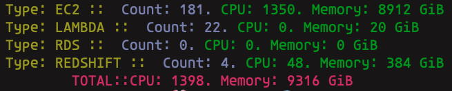

# AWS Compute

Compute AWS CPU and Memory resources.
`awscompute` supports listing of [4 types of resources](#supported-resources).

Why this project exist:
- [Dynatrace Pricing](https://www.dynatrace.com/pricing/) is based on Memory per host, this should provide a rough idea how much its about to cost.

---

---

[![governance][governance-badge]][governance-action]
[![governance.link-checker][governance.link-checker.badge]][governance.link-checker.status]

---

<!-- START doctoc generated TOC please keep comment here to allow auto update -->
<!-- DON'T EDIT THIS SECTION, INSTEAD RE-RUN doctoc TO UPDATE -->
## Contents

- [Supported resources](#supported-resources)
- [Create](#create)

<!-- END doctoc generated TOC please keep comment here to allow auto update -->

---

## Go How To

- [Migrate to Go V2](https://aws.github.io/aws-sdk-go-v2/docs/migrating/)

---

## Supported resources

Currently, 4 resource types across multiple services in the table below can be computed e.g. CPU and Memory

| Service / Type | Supported |
| :------------- | :--: |
| ec2 | ✅ |
| redshift | ✅ |
| lambda | ✅ |
| rds | ✅ |
| kafka | ✅ |

---

## Create

[**Create a repository using this template →**][template.generate]

<!-- resources -->
[template.generate]: https://github.com/cloudkats/awscompute/generate
[code-style.badge]: https://img.shields.io/badge/code_style-prettier-ff69b4.svg?style=flat-square

[governance-badge]: https://github.com/cloudkats/awscompute/actions/workflows/governance.bot.yml/badge.svg
[governance-action]: https://github.com/cloudkats/awscompute/actions/workflows/governance.bot.yml

[governance.link-checker.badge]: https://github.com/cloudkats/awscompute/actions/workflows/governance.links-checker.yml/badge.svg
[governance.link-checker.status]: https://github.com/cloudkats/awscompute/actions/workflows/governance.links-checker.yml
